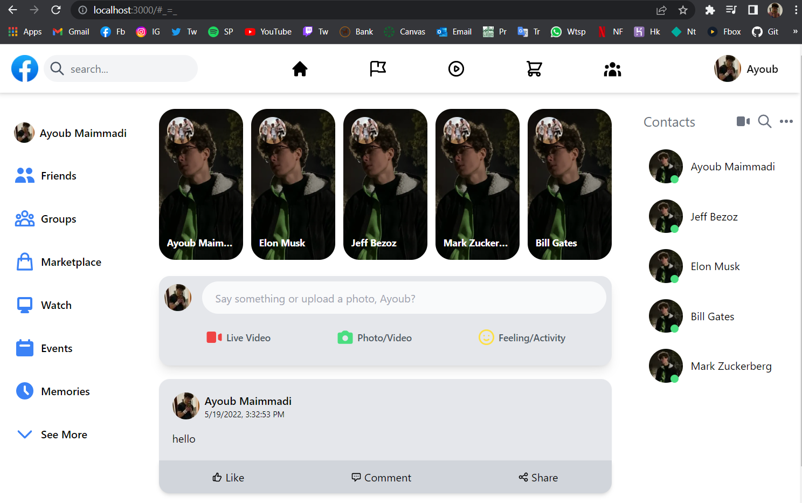
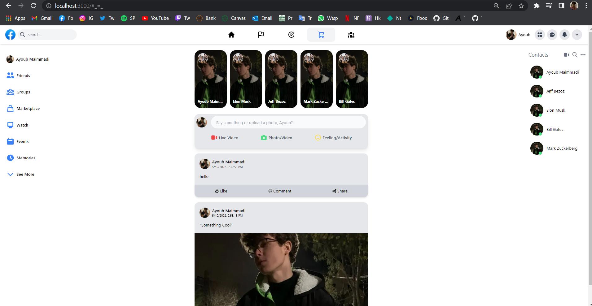

# Facebook Clone (Still In Production)

## A clone website to Facebook using Next and Tailwind.

### You can add new posts that are stored using Firebase.

To use you need to:

1- Clone or Download this repository

2- Have node.js pre-installed in you computer

3- Launch your IDE and cd into the projct

4- Install tailwindcss as a developement dependency: `yarn add -D tailwindcss`

4- open terminal and run:

##### - `npm or yarn install` to install node modules

##### - `npm or yarn run dev` to open developement at localhost:3000

#### You can see this website using the link

##### https://raw.githubusercontent.com/AyoubMaimmadi/Facebook-Clone/master/public/assets/main2.PNG

